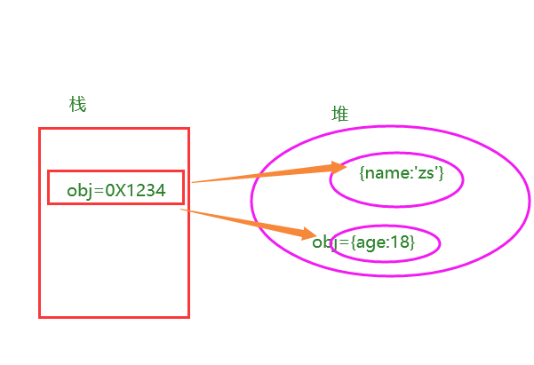

## MVC与MVVM的区别

- 区别

  MVC 是后端分层开发的概念，是由模型(model)层，视图(view)层和控制(controller)层构成的；三层架构

  MVVM是**前端视图层的概念，主要关注于 视图层分离，也就是说：MVVM把前端的视图层，分为了 三部分 Model, View , VM ViewModel**

- **什么叫MVVM？**

  ****

  **MVVM是这样分割的：M、V、VM。**

  上图中最右边的就是M—>model，最左边就是V—>View，中间就是VM—>ViewModel。VM起到连接HTML和JSON数据的桥梁作用。如果JSON数据层改变，那么就通过VM在内存中维护的 虚拟 DOM 重新点对点刷新 View 界面，点对点起到提高效率作用；然后，如果View的某个地方有数据改变，比如用户在input标签里输入内容，有数据变动，那么就映射到Model里面，这就是VM的监听作用。


## 比较Vue2与Vue3的响应式(重要)

### ==vue2的响应式==

Object.defineProperty  给对象添加属性，或者修改现有属性，使之变成响应式。

拦截，劫持  

访问这个属性的是：走getter(){}

设置值：走setter(){}


data、props、computed、watche  ==>为什么都是响应式的？

### ==问题（不足）：==

1. 对象新添加的属性或者删除已有属性，界面不会更新

   ```js
   data(){
       return{
           user:{
               name:'zs',
           }，
           arr:[2,4,6]
       }
   }
   
   //
   user.age=18;
   delete user.name 
   
   
   // 解决办法：
   Vue.$set(user,'age',18)  //优势：给user 添加的age ,变成了响应式的
   Vue.$delete(user,'name')  
   ```

2. 针对数组的问题：直接通过下标来替换元素，或者更新length， 界面也不会变

   ```js
   this.arr[1]=5;  
   
   //解决办法：
   this.$set(this.arr,1,5)
   this.$delete(this.arr,1)
   ```

3. 对于对象嵌套层次特别多的，靠递归来实现的响应式

   ```js
   obj:{
       a:{
           b:{
               c:10
           }
       }
   }
   
   Object.defineProperty(obj.a.b, 'c', {
       get () {
          reutrn  10
       }, 
       set (val) {
           
       }
   })
   ```

4. 对于数组，重写数组的方法（7个）


- 核心: 
  - 对象: 通过defineProperty对对象的==已有属性值==的读取和修改进行劫持(监视/拦截)
  - 数组: 通过重写数组更新数组一系列更新元素的方法来实现元素修改的劫持

```js
Object.defineProperty(data, 'count', {
    get () {
       reutrn  10
    }, 
    set (val) {
        
    }
})

data.count  //10
data.count=100
```

- 问题
  - 对象直接新添加的属性或删除已有属性, 界面不会自动更新
  
  - 直接通过下标替换元素或更新length, 界面不会自动更新   arr[1] = {}
  
    ```js
    obj:{
        a:{
            b:{
                c:10
            }
        }
    }
    
    Object.defineProperty(obj.a.b, 'c', {
        get () {
           reutrn  10
        }, 
        set (val) {
            
        }
    })
    ```
    
    


### 补充：对象更新检测

1. 说明：对象修改后 视图同步更新视图 -- 内存：栈内存 堆内存 

   可以修改已经存在的属性；

   可以修改整个对象；

   

   

   ==但是对于新添加的属性，不是响应式的。==

2. 实现对象视图同步更新

   1. Vue.set( target, propertyName/index, value )
      参数：
          {Object | Array} target
          {string | number} propertyName/index
          {any} value
          返回值：设置的值。
      用法：
          向响应式对象中添加一个 property，并确保这个新 property 同样是响应式的，且触发视图更新。它必须用于向响应式对象上添加新 property，因为 Vue 无法探测普通的新增 property (比如 this.myObject.newProperty = 'hi')

      组件内部：
      
      ```js
      this.$set(this.obj,'age',18)
      ```
      
      
      
    2. 代码演示
   
    ```js
        addAttribute(){
            // this.obj.sex='女'
            // console.log('obj',this.obj);
            //问题：vue认为 obj没有修改
            //1. ...  
            // this.obj ={...this.obj};
            //2. es6: 合并对象  Object.assign({},{},{}) 
            // this.obj=Object.assign({},this.obj)
   
            //3. vue官网解决方法：
            //向响应式对象中添加一个 property，并确保这个新 property 同样是响应式的，且触发视图更新。
            // this.$set(this.obj,'sex','女')
            Vue.set(this.obj,'fav','学习')
   
            //删除 同步视图 删除对象的 property。如果对象是响应式的，确保删除能触发更新视图。
            Vue.delete(this.obj,'age')
        }
   
    ```


  

### 补充知识：数组更新检测（数组相关API）

#### 1、变更方法（修改原始数据）：

Vue对数据的操作都是响应式的，而数组对数据的操作默认都不是响应式的。所以，Vue对数组的操作需要变成响应式的，这样，只要操作了数组中的数据，页面中的模板内容就跟着发生变化。所谓的==变更方法，就是Vue把原生的方法变成了响应式的方式。== 共性就是都会影响原始的数据。

Vue 将被侦听的数组的变更方法进行了包裹，所以它们也将会触发视图更新。这些被包裹过的方法包括：

| `push()`    | 往数组最后面添加一个元素，成功返回当前数组的长度             |
| ----------- | ------------------------------------------------------------ |
| `pop()`     | 删除数组的最后一个元素，成功返回删除元素的值                 |
| `shift()`   | 删除数组的第一个元素，成功返回删除元素的值                   |
| `unshift()` | 往数组最前面添加一个元素，成功返回当前数组的长度             |
| `splice()`  | 有三个参数，第一个是想要删除的元素的下标（必选），第二个是想要删除的个数（必选），第三个是删除 后想要在原位置替换的值 |
| `sort()`    | sort()  使数组按照字符编码默认从小到大排序,成功返回排序后的数组 |
| `reverse()` | reverse()  将数组倒序，成功返回倒序后的数组                  |


#### 2、替换数组（生成新的数组）：

变更方法，顾名思义，会变更调用了这些方法的原始数组。相比之下，也有非变更方法，例如 `filter()`、`concat()` 和 `slice()`。它们不会变更原始数组，而**总是返回一个新数组**。当使用非变更方法时，可以用新数组替换旧数组：

| filter | filter() 方法创建一个新的数组，新数组中的元素是通过检查指定数组中符合条件的所有元素。 |
| ------ | ------------------------------------------------------------ |
| concat | concat() 方法用于连接两个或多个数组。该方法不会改变现有的数组 |
| slice  | slice() 方法可从已有的数组中返回选定的元素。该方法并不会修改数组，而是返回一个子数组 |


#### 举例：变更方法

```html
<input type="text" v-model='fname'>
<button @click='add'>添加</button>
<button @click='del'>删除</button>
<button @click='change'>替换</button>

<ul>
    <li :key='index' v-for='(item,index) in list'>{{item}}</li>
</ul>
```

Js:

```js
data: {
    fname: '',
        list: ['apple','orange','banana']
},
    methods: {
        add: function(){
            this.list.push(this.fname);
        },
            del: function(){
                this.list.pop();
            },
            change: function(){
          // 截取数组  
          // 如果只是截取数组：this.list.slice(0,2);并不会影响原始数组
          // 必须得把截取后的数组重新赋值给原始数组
          this.list = this.list.slice(0,2);
        }
    }
```


#### 3、数组响应式变化：

除了用上面提供的API之后，还可以通过索引直接操作数组。但是通过索引操作并不是响应式的，但是Vue 也提供了以下两种方法：

一、通过Vue对象调用 ：

```js
Vue.set(vm.items,indexOfItem,newValue) 
```

二、通过vue示例调用

```j
vm.$set(vm.items,indexOfItem,newValue)
```

1. 参数一：要处理的数组名称
2. 参数二：要处理的数组的索引
3. 参数三：要处理的数组的值

```html
<ul>
    <li v-for='item in list'>{{item}}</li>
</ul>
<div>
    <div>{{info.name}}</div>
    <div>{{info.age}}</div>
    <div>{{info.gender}}</div>
</div>
```


```js
/*
      动态处理响应式数据      
    */
var vm = new Vue({
    el: '#app',
    data: {
        list: ['apple', 'orange', 'banana'],
        info: {
            name: 'lisi',
            age: 12
        }
    },
});
// 用索引方式修改数据并不是响应式的
// vm.list[1] = 'lemon';
// 通过对象方式调用，可以修改数组里的值
// Vue.set(vm.list, 2, 'lemon');
// 通过实例方式
vm.$set(vm.list, 1, 'lemon');

```


总结：

这两个API ==既可以来处理数组的索引，又可以处理对象的属性 变成响应式的。==


## ==Vue3的响应式==

#### Vue2不足：

1. 对象新添加属性或者删除已有属性，界面不更新  Vue.$set( )  $delete

   对象嵌套层次比较高的，里面的属性变成响应式，靠递归实现的

2. 数组： 通过下标修改值，修改length ，界面不更新 Vue.$set( ) $delete

   Vue2内部对数组，重写数组的7个方法


- 核心: 

  - 通过Proxy(代理):  拦截对data任意属性的任意(13种)操作, 包括属性值的读写, 属性的添加, 属性的删除等...

  - ref() 基本数据类型 Object.defineProperty() 

  - reactive({})  []  Proxy   ref(null)  ref([])  ==>proxy

  - 通过 Reflect(反射):  动态对被代理对象的相应属性进行特定的操作

  - 文档:

    - https://developer.mozilla.org/zh-CN/docs/Web/JavaScript/Reference/Global_Objects/Proxy
  
      
  
    - https://developer.mozilla.org/zh-CN/docs/Web/JavaScript/Reference/Global_Objects/Reflect

```js
//被代理
const data={
    name:'lucy',
    age:19
}
//proxyData 代理对象
const proxyData= new Proxy(data, {
	// 拦截读取属性值
    get (target, prop) {
    	return Reflect.get(target, prop)
    },
    // 拦截设置属性值或添加新属性
    set (target, prop, value) {
    	return Reflect.set(target, prop, value)
    },
    // 拦截删除属性
    deleteProperty (target, prop) {
    	return Reflect.deleteProperty(target, prop)
    }
})

proxy.name = 'tom'   
```


```html
<!DOCTYPE html>
<html lang="en">
<head>
  <meta charset="UTF-8">
  <meta name="viewport" content="width=device-width, initial-scale=1.0">
  <title>Proxy 与 Reflect</title>
</head>
<body>
  <script>
    
    const user = {
      name: "John",
      age: 12
    };

    /* 
    proxyUser是代理对象, user是被代理对象
    后面所有的操作都是通过代理对象来操作被代理对象内部属性
    */
    const proxyUser = new Proxy(user, {

      get(target, prop) {
        console.log('劫持get()', prop)
        return Reflect.get(target, prop)
      },

      set(target, prop, val) {
        console.log('劫持set()', prop, val)
        return Reflect.set(target, prop, val); // (2)
      },

      deleteProperty (target, prop) {
        console.log('劫持delete属性', prop)
        return Reflect.deleteProperty(target, prop)
      }
    });
    // 读取属性值
    console.log(proxyUser===user) //false
    console.log(proxyUser.name, proxyUser.age)
    // 设置属性值
    proxyUser.name = 'bob'
    proxyUser.age = 13
    console.log(user)
    // 添加属性
    proxyUser.sex = '男'
    console.log(user)
    // 删除属性
    delete proxyUser.sex
    console.log(user)
  </script>
</body>
</html>
```


### 总结：

vue2.x和vue3.0 ==数据代理的方式==不一样，实现==数据响应式的方式==也不一样。

vue2.x和vue3.0的数据代理及数据响应式的原理

​    vue2.x中是通过object.defineProperty方法实现数据代理(内部需要进行==遍历==data对象)，==data被代理对象，vm(vue的实例)是代理==

```js
object.defineProperty(vm,'arr',{
   get(){
       retutrn data.arr
   }
})
this== >vm 

vm.msg  ==>this.msg
vm.arr  ===>this.arr
```


​    vue3.0中是通过Proxy对象来实现数据代理，而且==深层次的，而且不需要遍历==（vue2.x中如果当前的对象是响应式的对象，要想添加响应式的属性，通过vue.set方法或者$set方法,vue3.0不需要）

```js
obj:{
    a:{
        b:{
            c:10
        }
    }
}
```


​    vue2.x中的数据响应式需要循环遍历（==劫持对象+watcher==）

​    vue3.0中通过==Proxy代理+Reflect反射对象==，不需要循环遍历，而且还是深层次的

​    vue2.x中效率和vue3.0相比(效率更高),


## 逻辑复用（Vue2&Vue3）

模块（JS）、模块化、组件(HTML+CSS+JS)、组件化

官方话术：

\- 混入 (mixin) 提供了一种非常灵活的方式，来分发 Vue 组件中的可复用功能。一个混入对象可以包含任意组件选项。当组件使用混入对象时，所有混入对象的选项将被“混合”进入该组件本身的选项。


理解全局混入：所有组件混入了这些逻辑代码

```js
// 全局混入 全局mixin
// vue2.0 写法  Vue.mixin({})
Vue.mixin({
  methods: {
    say () {
      console.log(this.$el,'在mounted中调用say函数')
    }
  },
  mounted () {
    this.say()
  }
})

```


理解局部混入：通过mixins选项进行混入

点赞 ：button

文章点赞： a


```js
// 配置对象
export const Mixin =  {
  data () {
    return {
      loading: false
    }
  },
  methods: {
    followFn () {
      this.loading = true
      // 模拟请求
      setTimeout(()=>{
        // 省略请求代码
        this.loading = false
      },2000)
    }
  }
}
```


**总结：** 在vue2.0中一些可复用的逻辑可以使用mixins来封装，当是需要考虑逻辑代码冲突问题。vue3.0的组合API很好的解决了这个问题，就不在推荐使用mixins了。


## setup细节

- setup执行的时机

  - 在beforeCreate之前执行(一次), 此时组件对象还没有创建
  - this是undefined, 不能通过this来访问data/computed/methods / props
  - 其实所有的composition API相关回调函数中也都不可以

- setup的返回值

  - 一般都返回一个对象: 为模板提供数据, 也就是模板中可以直接使用此对象中的所有属性/方法

  - 返回对象中的属性会与data函数返回对象的属性合并成为组件对象的属性

    在mounted里打印下 this，即可看到

  - 返回对象中的方法会与methods中的方法合并成为组件对象的方法

    在mounted里打印下 this，即可看到

  - 如果有重名, setup优先

  - 注意: 

    -  一般不要混合使用: methods中可以访问setup提供的属性和方法, 但在setup方法中不能访问data和methods
    -  setup不能是一个async函数: 因为返回值不再是return的对象, 而是promise, 模板看不到return对象中的属性数据

- setup的参数

  - setup(props, context) / setup(props, {attrs, slots, emit})

  - props: 包含props配置声明且传入了的所有属性的对象

    得到父级组件向子级组件传递过来的数据

  - attrs: 包含没有在props配置中声明的属性的对象, 相当于 this.$attrs 

    得到父级组件向子级组件传递过来的数据==并且没有通过props接受过的数据==

  - slots: 包含所有传入的插槽内容的对象, 相当于 this.$slots

  - emit: 用来分发父级组件向子级组件传递的自定义事件的函数, 相当于 this.$emit


#### 父组件：

```vue
<template>
  <h2>App</h2>
  <p>msg: {{msg}}</p>
  <button @click="fn('--')">更新</button>

  <child :msg="msg" msg2="cba" @fn="fn"/>
</template>

<script lang="ts">
import {
  reactive,
  ref,
} from 'vue'
import child from './child.vue'

export default {
  components: {
    child
  },

  setup () {
    const msg = ref('abc')
    function fn (content) {
      msg.value += content
    }
    return {
      msg, fn
    }
  }
}
</script>
```


#### 子组件：

```vue
<template>
  <div>
    <h3>{{n}}</h3>
    <h3>{{m}}</h3>

    <h3>msg: {{msg}}</h3>
    <h3>msg2: {{$attrs.msg2}}</h3>

    <slot name="xxx"></slot>

    <button @click="update">更新</button>
  </div>
</template>

<script lang="ts">

import {
  ref,
  defineComponent
} from 'vue'

export default defineComponent({
  name: 'child',
  props: ['msg'],
  emits: ['fn'], // 可选的, 声明了更利于程序员阅读, 且可以对分发的事件数据进行校验

  data () {
    console.log('data', this)
    return {
      // n: 1
    }
  },

  beforeCreate () {
    console.log('beforeCreate', this)
  },

  methods: {
    // update () {
    //   this.n++
    //   this.m++
    // }
  },

  // setup (props, context) {
  setup (props, {attrs, emit, slots}) {
	// 组件未创建，this 没法使用，所以给传递 props
    console.log('setup', this)
    console.log(props.msg, attrs.msg2, slots, emit)

    const m = ref(2)
    const n = ref(3)

    function update () {
      // console.log('--', this)
      // this.n += 2 
      // this.m += 2

      m.value += 2
      n.value += 2

      // 分发自定义事件
      emit('fn', '++')
    }

    return {
      m,
      n,
      update,
    }
  },
})
</script>
```


## reactive与ref-细节

-  是Vue3的 composition API中==2个最重要的响应式API==
-  ref用来处理基本类型数据, reactive用来处理对象(递归深度响应式)
-  如果用ref对象/数组, ==内部会自动将对象/数组转换为reactive的代理对象==
-  ==ref内部: 通过给value属性添加getter/setter来实现对数据的劫持==
-  reactive内部: 通过使用Proxy来实现对对象内部所有数据的劫持, 并==通过Reflect操作对象内部数据==
-  ref的数据操作: 在js中要.value, 在模板中不需要(内部解析模板时会自动添加.value)

```vue
<template>
  <h2>App</h2>
  <p>m1: {{m1}}</p>
  <p>m2: {{m2}}</p>
  <p>m3: {{m3}}</p>
  <button @click="update">更新</button>
</template>

<script lang="ts">
import {
  reactive,
  ref
} from 'vue'

export default {

  setup () {
    const m1 = ref('abc')
    const m2 = reactive({x: 1, y: {z: 'abc'}})

    // 使用ref处理对象  ==> 对象会被自动reactive为proxy对象
    // ref函数中可以放入一个对象,但是内部做了reactive的处理,形成了一个Proxy类型的对象---也是响应式的对象,也是深层次的
    const m3 = ref({a1: 2, a2: {a3: 'abc'}})
    console.log(m1, m2, m3)
    console.log(m3.value.a2) // 也是一个proxy对象

    function update() {
      m1.value += '--'
      m2.x += 1
      m2.y.z += '++'

      m3.value = {a1: 3, a2: {a3: 'abc---'}}
      m3.value.a2.a3 += '==' // reactive对对象进行了深度数据劫持
      console.log(m3.value.a2)
    }

    return {
      m1,
      m2,
      m3,
      update
    }
  }
}
</script>
```


## 新增组件

### 1、Fragment(片断)  

- 在Vue2中: 组件必须有一个根标签
- 在Vue3中: 组件可以没有根标签, 内部会将多个标签包含在一个Fragment虚拟元素中
- 好处: 减少标签层级, 减小内存占用

```vue
<template>
    <h2>aaaa</h2>
    <h2>aaaa</h2>
</template>
```


### 2、Teleport(瞬移组件)

- Teleport 提供了一种干净的方法, 让组件的html在父组件界面外的特定标签(很可能是body)下插入显示
- 

ModalButton.vue

```vue
<template>
  <button @click="open = true">打开弹出框</button>

  <teleport to="body">
    <div v-if="open" class="modal">
      <div>
        <button @click="open = false">关闭</button>
      </div>
    </div>
  </teleport>
</template>

<script>
import { ref } from "vue";
export default {
  name: "modal-button",
  setup() {
    const open = ref(false);
    return {
      open
    };
  }
};
</script>


<style>
.modal {
  position: absolute;
  top: 0;
  right: 0;
  bottom: 0;
  left: 0;
  background-color: rgba(0, 0, 0, 0.5);
}
.modal div {
  background-color: white;
  width: 300px;
  height: 300px;
  position: absolute;
  top: 50%;
  left: 50%;
  transform: translate(-50%, -50%);
}
</style>
```


### 3、Suspense(不确定的、实验性功能)

后面有可能会变

- 它们允许我们的应用程序在等待异步组件时渲染一些后备内容，可以让我们创建一个平滑的用户体验
- ==好处：在HTML模板中写异步判断，成功，等待==

```vue
<template>
  <Suspense>
    <template v-slot:default>
      <AsyncComp/>
      <!-- <AsyncAddress/> -->
    </template>

    <template v-slot:fallback>
      <h1>LOADING...</h1>
    </template>
  </Suspense>
</template>

<script lang="ts">
/* 
异步组件 + Suspense组件
*/
// import AsyncComp from './AsyncComp.vue'
import AsyncAddress from './AsyncAddress.vue'
import { defineAsyncComponent } from 'vue'
const AsyncComp = defineAsyncComponent(() => import('./AsyncComp.vue'))
export default {
  setup() {
    return {
     
    }
  },

  components: {
    AsyncComp,
    AsyncAddress
  }
}
</script>
```

- AsyncComp.vue

```vue
<template>
  <h2>AsyncComp22</h2>
  <p>{{msg}}</p>
</template>

<script lang="ts">

export default {
  name: 'AsyncComp',
  setup () {
    // return new Promise((resolve, reject) => {
    //   setTimeout(() => {
    //     resolve({
    //       msg: 'abc'
    //     })
    //   }, 2000)
    // })
    return {
      msg: 'abc'
    }
  }
}
</script>
```

- AsyncAddress.vue

```vue
<template>
<h2>{{data}}</h2>
</template>

<script lang="ts">
import axios from 'axios'
export default {
  async setup() {
    const result = await axios.get('/data/address.json')
    return {
      data: result.data
    }
  }
}
</script>
```


# ==Vue2 VS Vue3==

### 1、优势

1. 性能高、速度快、体积小...
2. 类型推断，支持TS(typescript)
3. 组合API，更好的封装逻辑，复用逻辑
4. 未来趋势，很火框架，本身定位适合做大型项目


### 2、setup

特点：

1. 组合API起点

2. 从生命周期的角度说，很早，比Vue2最早的生命周期还要早  beforeCreate还要早

3. this，undefined  

4. 定义的数据，界面中想要使用，必须在最后 return {}

5. 参数：

   ```js
   setup(props,context){
       
   }
   ```

   props :父组件向子组件传递是数据

   context: 上下文  {attrs,slots,emit}

   attrs：父组件向子组件传递是数据，但是没有通过props接受

   slots：所有传入的插槽的对象  相当于 this.$slots

   emit:    子组件触发自定义事件的   相当于  this.$emit('')

   

### 3、生命周期

组件从创建到销毁的过程。钩子函数，

Vue2:11个，8个

回顾vue2.x生命周期钩子函数：

- beforeCreate
- ==created==       this；最早发送网络请求 this.list=
- beforeMount
- ==mounted==  操作DOM ，绑定事件  开启定时器；
- beforeUpdate
- updated
- ==beforeDestroy==   销毁之前，收尾工作，关闭定时器，解绑事件，例如：表单，友好提醒
- destroyed

认识vue3.0生命周期钩子函数

- `setup` 创建实例前
- `onBeforeMount` 挂载DOM前
- `onMounted` 挂载DOM后
- `onBeforeUpdate` 更新组件前
- `onUpdated` 更新组件后
- `onBeforeUnmount` 卸载销毁前
- `onUnmounted` 卸载销毁后


##### 注意：

1. Vue3生命周期普通比Vue 2 早
2. Vue3 可以多次使用同一个生命周期钩子函数，执行顺序和书写顺序一致   好处：不同的逻辑，写在同一个生命周期中，分开写
3. 生命周期要写在setup里
4. 所有生命周期都需要按需引入


### 4、组件数据

Vue2：data、props、computed  都是响应式

Vue3 响应式：

定义：

ref函数：基本数据类型，变成响应式

修改：  num.value=xxx

reactive 函数： 复杂数据类型变成响应式   [], {}

toRef      toRefs


### 5、组件传值

1. props
2. Provide/Inject   数据是响应式的


### 6、响应式

##### Vue2：

核心: 

- 对象: 通过defineProperty==对对象的已有属性值的读取和修改进行劫持==(监视/拦截)
- 数组: 通过重写数组更新数组一系列更新元素的方法来实现元素修改的劫持


问题（不足之处）：

- 对象直接新添加的属性或删除已有属性, 界面不会自动更新 $set  $delete

  对于深层次的对象，响应式的实现，是递归来实现

- 数组：直接通过下标替换元素或更新length, 界面不会自动更新   arr[1] = {}  $set  $delete


##### Vue3:

- 通过Proxy(代理):  拦截对data任意属性的任意(13种)操作, 包括属性值的读写, 属性的添加, 属性的删除等...

- 通过 Reflect(反射):  动态对被代理对象的相应属性进行特定的操作


#### 总结：

vue2.x和vue3.0 ==数据代理的方式==不一样，实现==数据响应式的方式==也不一样。

vue2.x和vue3.0的数据代理及数据响应式的原理

​    vue2.x中是通过object.defineProperty方法实现数据代理(内部需要进行遍历data对象)，==data被代理对象，vm(vue的实例)是代理==

​    vue3.0中是通过Proxy对象来实现数据代理，而且==深层次的，而且不需要遍历==（vue2.x中如果当前的对象是响应式的对象，要想添加响应式的属性，通过vue.set方法或者$set方法,vue3.0不需要）

​    vue2.x中的数据响应式需要循环遍历（==劫持对象+watcher==）

​    vue3.0中通过==Proxy代理+Reflect反射对象==，不需要循环遍历，而且还是深层次的

​    vue2.x中效率和vue3.0相比(效率更高),


### 7、逻辑复用

#### Vue2：

mixin1.JS：混入

```js
{
    data(){
        return{
            msg:'123'
        }
    }
}
```

mixin2.JS：混入

```js
{
    data(){
        return{
            msg:'123'
        }
    }
}
```

A.vue   B.vue

==弊端：容易代码冲突==

#### vue3:

Hooks 方式，所有复用的地方提升函数，引入的函数可以重新命名，不会出现冲突问题。

```js
const  count=useCout()

const   num=useNum()
```


### 8、新增组件

#### （1）Fragment(片断)

- 在Vue2中: 组件必须有一个根标签
- 在Vue3中: 组件可以没有根标签, 内部会将多个标签包含在一个Fragment虚拟元素中
- 好处: 减少标签层级, 减小内存占用

#### （2）Teleport(瞬移)

- Teleport 提供了一种干净的方法, 让组件的html在父组件界面外的特定标签(很可能是body)下插入显示

#### （3）Suspense(不确定的)

- 它们允许我们的应用程序在等待异步组件时渲染一些后备内容，可以让我们创建一个平滑的用户体验
- 好处：在HTML模版中写异步判断，成功，失败


