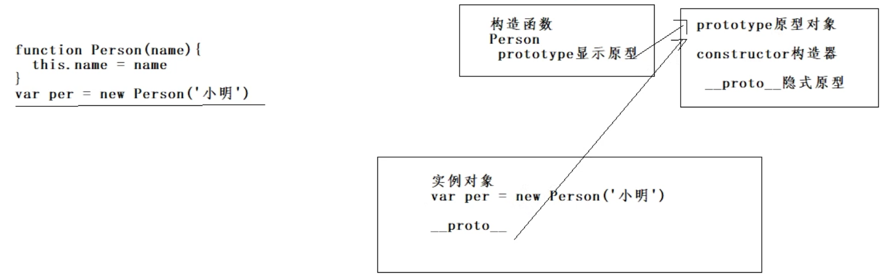
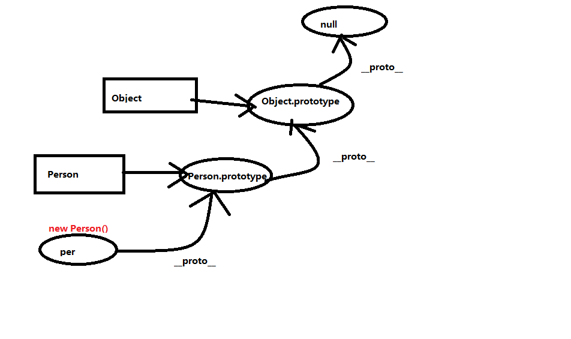
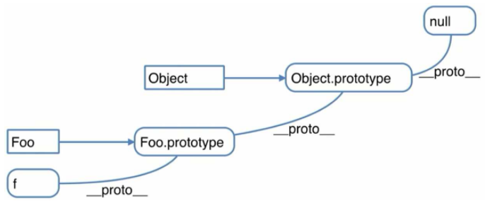
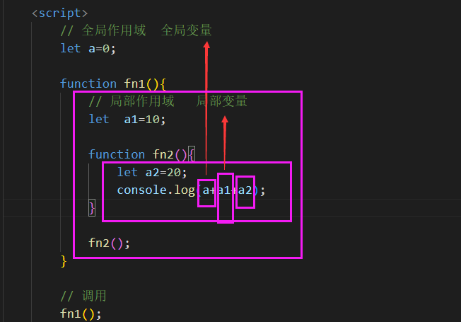
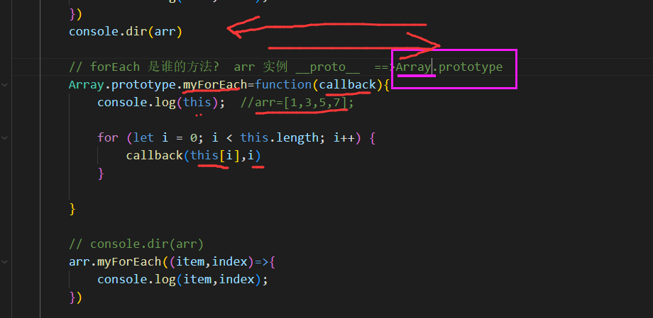
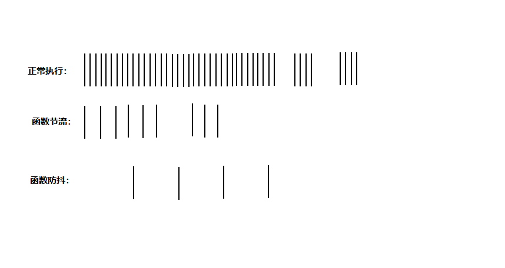
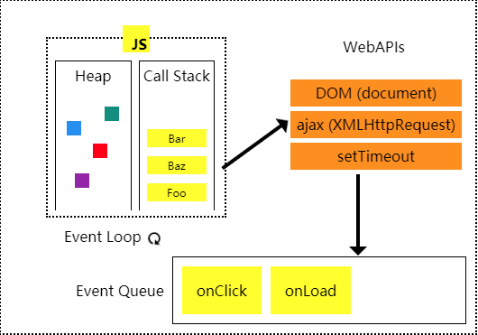

js是弱类型语言,声明变量都用var msg='123';     string num=123
js是脚本语言 直接执行
js是解释性语言 直接解释
js是动态类型语言 变量在执行的时候才知道具体的类型,对象没有这个属性,点了,就有了
js是单线程语言 执行的时候按照一定的顺序,之前的代码执行完毕后,后面才执行
js是基于对象的语言,最终所有的对象都指向了object

## 一、对象

### 1、创建对象的方式：

```js
// 1、字面量方式
let obj = {}
// 2、通过工厂方式
function createObj(name, age) {
    var obj = new Object();
    obj.name = name;
    obj.age = age;

    return obj;
}
var obj1 = createObj('zs', 18)
var obj2 = createObj('li', 19)
console.log(obj1, obj2);

// 3、构造函数创建对象
function Person(name, age) {
    // this:{}   属性和方法
    this.name = name;
    this.age = age;
    this.say = function () {
        console.log('Hello,我是 ' + this.name);
    }
}
// 实例  {}
var per = new Person('ww', 20)
console.log(per.name);
per.say();

```

#### 通过构造函数创建对象的 4步骤：

1. 开辟新的内存空间，用来存放实例化对象
2. 设置this 为当前对象（改变this的指向）
3. 给这个对象添加属性和方法
4. 返回this这个实例对象

#### ES6-class创建

```js
class Student {
            // 构造器 构造器中的属性，最终都在实例对象
            constructor(name,age) {
                this.name=name;
                this.age=age;
            }
            // 在原型上
            sayHi(){
                console.log(`我是${this.name},今年${this.age}岁了...`);
            }

            // 用= 方式，都在实例上
            eat=()=>{
                console.log('吃.....');
            }

            run=function(){
                console.log('玩.....');
            }


        }
        var stu=new Student('zl',21)
        stu.sayHi();
        stu.eat();
        stu.run();
        console.dir(stu)
```

==注意：class中书写方法的时候，如果方法使用的是 = 赋值的，那么方法在实例上！！！==

#### 单例模式

不管对象创建多少次，实际上，最终对象只有一个

```js
class Person{
  
}


function createObj() {
    var instance = null
    return function (name) {
        if (!instance) {
            instance = new Person()
            instance.name =name
        }
        return instance
    }
}
var getObj = createObj()
var obj1 = getObj('zs')
var obj2 = getObj('ls')
console.log(obj1,obj2)
console.log(obj1===obj2)  //true  同一个对象
```

#### 属性访问：

```js
  访问：对象.属性名字  obj.name  
     对象['属性名字']  obj['name']
    什么时候使用对象[属性名字]的写法  obj.info-name 'info-name'   obj['info-name']
   		不确定属性名字是什么(属性名字是变量) obj.[变量]
   		属性名字不太规范的时候   obj['user/getters']  
```

### 2、面向对象特性

面向过程：凡事亲力亲为，按部就班，注重的是过程

面向对象：提出需求，抽象出对象，封装并调用对象的属性和方法，获取结果。

封装：把对象的属性、方法放到构造函数里来写，就是封装；很多重复的代码放到函数里；功能函数放到单独的js文件里，也叫封装

函数、对象、模块、组件、库 都体现了封装

继承：在js中通过改变==原型的指向==来实现继承，有了继承可以实现多态，

多态就是：同一个行为，针对不同的对象产生出来的结果是不一样的。JS中很少用多态

### 3、继承

继承是==类与类之间的关系==，人类和老师类=》父类，子类；老师类继承自人类；人类有的老师类都有，老师类有的人类不一定有。

继承(改变原型指向/借用构造函数/组合/拷贝)

方式一: 基于构造函数的继承: 原型链 + 借用构造函数的组合式继承

- 借用父类型构造函数: Person.call(this, name, age)
- 让子类的原型为父类的实例: Student.prototype = new Person()
- 让子类型原型的构造器为子类型: Student.prototype.constructor = Student

```js
    // 通过原型实现继承
    function Person(name,age,gender){
      this.name = name 
      this.age =age
      this.gender = gender
    }
    Person.prototype.sayHi=function(){
      console.log('Hi。。。')
    }
    Person.prototype.eat=function(){
      console.log('人类吃....')
    }
    function Student(name,age,gender,score){
      // 借用构造函数实现属性的继承
      Person.call(this,name,age,gender)
      this.score = score
    }
    // 原型实现方法的继承
    Student.prototype=new Person()
    Student.prototype.constructor = Student
    // 重写方法
    Student.prototype.eat=function(){
      console.log('学生吃')
    }
    var stu = new Student('zs',20,'男',99)
    stu.sayHi()
    stu.eat()
    console.log(stu)
```

方式二: 基于class/类的继承

- 子类 extends 父类: class Teacher extends Person2
- 子类构造器中调用父类的构造: super(name, age)

```javascript
    // ES6的方式实现继承
    class Person{
      constructor(name,age){
        this.name = name
        this.age = age
      }
   
      // 原型上的方法
      sayHi(){
        console.log('Hi')
      }
      // 实例属性
      sex = '男'
      // 实例上的方法 run =function(){}
      eat=()=>{
        console.log('吃....')
      }
      // 静态属性
      static gender='男'
    }
    var per = new Person('zs',13)
    console.log(per)
    console.dir(Person)

    class Student extends Person{
      constructor(name,age,gender){
        super(name,age)
        this.gender = gender
      }
      // 重写父类中的方法
      sayHi(){
        console.log('我很好')
      }
    }
    var stu = new Student('ls',20,'男')
    console.log(stu)
```

## 二、原型

俩链一包

面试：你来说一下对原型的理解？ What？ Why? How?

回答思路：原型是什么？有哪一些？原型什么时候产生？作用是什么？应用在哪里？

prototype ` __proto__`

#### What？

原型就是对象，JS中原型一共有两个,一个是prototype(显示原型)，一个是**`__proto__`属性** （隐式原型）

这两个都叫做原型属性。是属性，也是对象。

### When :1、原型是什么时候产生的？

==函数定义的时候，prototype显示原型就会创建出来==；由于函数本身的对象（实例对象），所以，==实例化对象的时候 `__proto__`会产生==。

#### Why? 为什么要用，作用：

1. 程序员使用，添加共用的属性和方法，节省内存空间
2. 通过改变原型指向，来实现继承中
3. 应用：

   Vue.prototype.$axios=axios  ;

   Vue.prototype.$bus

   Vue.prototype.$echarts

   this.

由于函数本身是函数，又是对象，所以具有两个原型，一个是显示的prototype，另一个是隐式的 `__proto__`

```js

//函数定义和函数区别
// f1是什么？f1是函数,或函数名，或者叫引 用变量
// 函数定义：函数声明和函数表达式

//定义
function f1() {  // Funtion
     log(this)
     console.log('f1函数定义');
}
console.dir(f1); //函数定义即产生了prototype


```

#### 原型是什么？

    答：原型是对象，JS中有2个  prototype` __proto__`，都叫原型属性，既是属性，又是对象

    函数定义的时候，显示原型prototype 和 隐式原型`__proto__` 就已经产生

作用：

    prototype：程序员使用的，添加共有的属性和方法

    隐式原型`__proto__`： 每个实例对象，都有 `__proto__`，指向 构造函数

    无论是普通函数，还是构造函数，包括方法，只要是函数，都有prototype

    实例上有`__proto__`

- ==实例的 `__proto__`与对应函数的prototype都指向原型对象==
- 
- per.__proto__ ===Person.prototype



per.song()

#### 作用1：共享数据，节省内存空间

```js
function Person(name) {
    this.name = name
    // this.eat=function(){
    //     console.log('吃');
    // }
}
// console.log(per1.eat == per2.eat); //false 

Person.prototype.eat = function () {
    console.log('吃');
}
var per1 = new Person('zs');
var per2 = new Person('li');

console.log(per1.eat == per2.eat); //true
```

#### 作用2: 实现JS中继承

##### （1）通过改变原型指向实现继承

子类的原型指向父类的实例

```js
function Student(name,age){
    this.name=name;
    this.age=age;
}
// 核心：子类的原型指向父类的实例
Student.prototype=new Person();
let stu=new Student('damao',19);
stu.eat();
```

（2）借用构造函数显示继承

（3）组合继承

通过改变原型指向实现的是==方法的继承==，通过借用构造函数的方法实现的是==属性继承==，二者结合为一体，称为==组合继承（常用的）==。

#### 作用2: 3、应用：  Vue.prototype.$bus  Vue.prototype.$Echart axios

### 2、原型链 `__proto__`

(实际上是隐式原型链，言外之意就是和显示原型没毛关系，显示原型产生实例的一瞬间起的作用)

==原型链：隐式原型和显示原型之间的关系==

- 从对象的 `__proto__`开始, 连接的所有对象, 就是我们常说的原型链, 也可称为 `隐式原型链`
- 查找对象属性简单说: 先在自身上查找, 找不到就沿着原型链查找,如果还找不到返回undefined

  

  run()

1. 查找对象上属性的基本流程

   1. 先在对象自身上查找, 如果有, 直接返回
   2. 如果没有, 根据 `__proto__`在原型对象上查找, 如果有, 直接返回
   3. 如果没有根据原型对象的 `__proto__`在原型对象的原型对象上查找, 一直查找到Object原型对象为止
   4. 如果找到了返回, 如果查找不到由于它的 `__proto__`为null, ==只能返回undefined==

## 三、闭包

闭包：谈一下对闭包的理解？

回答思路：是什么？什么时候产生？闭包的优缺点？应用？

先说：

    作用域：变量使用的范围 （写代码的时候就已经确定了作用域）

    分为：全局作用域、局部作用域、块级作用域（const let）

    作用：隔离变量

函数内部可以访问函数外部的变量；==》局部作用域可以访问全局作用域的变量

反之，不可以



```js
 let a = 0;

function fn1() {
    let a1 = 10;

    function fn2() {
        let a2 = 20;
        console.log(a + a1 + a2);;
    }
    fn2();
}

fn1()
console.log(a1);
```

```js
// 函数之间有嵌套关系，内部函数使用了外部函数中的变量，内部函数在函数定义的时候，就形成了闭包
function fn1(){
    var a=2;
    function fn2(){
        a++;
        console.log(a);
    }
    return fn2;
}

var f=fn1();
f();

// 作用：
// 1、让外部函数可以操作（读写）内部函数的数据（变量/函数）
// 2、延长局部变量生命周期，不被回收
// 3、避免全局变量的污染
// 4、可以定义私有属性和方法==》模块化，JQuery

// 闭包的优缺点
// 不及时清理，导致内存溢出泄漏

// 应用？模块化
```

#### 参考文档：

https://zhuanlan.zhihu.com/p/386803415

**用闭包模拟私有方法**

```js
var Counter = (function() {
    var privateCounter = 0   // 私有变量
    function changBy(val) {
        privateCounter += val
    }
    return {
        intcrement: function() {  // 三个闭包共用一个词法语境
            changBy(1)
        },
        delcrement: function() {
            changBy(-1)
        },
        value: function() {
            return privateCounter
        }
    }
})()

console.log(Counter.value()) // 0
Counter.intcrement()
Counter.intcrement()
console.log(Counter.value()) // 2
Counter.delcrement()
console.log(Counter.value()) // 1
```

可以把这个函数储存在另一个变量makeCounter中并用它来创建多个计数器。

```js
var makeCounter = (function() {
    var privateCounter = 0
    function changBy(val) {
        privateCounter += val
    }
    return {
        intcrement: function() {
            changBy(1)
        },
        delcrement: function() {
            changBy(-1)
        },
        value: function() {
            return privateCounter
        }
    }
})()

var Counter1 = makeCounter()
var Counter2 = makeCounter()  // 每个闭包都是引用自己词法作用域内的变量privateCounter

console.log(Counter1.value(), Counter2.value()) // 0 0
Counter1.intcrement()
console.log(Counter1.value(), Counter2.value()) // 1 0
```

一个闭包内对变量的修改，不会影响另一个闭包的变量

> **以这种方式使用闭包，提供了许多面向对象编程的相关好处——特别是数据隐藏和封装**

## 四、this在不同环境下指向

```html
 <style>
        .box {
            width: 100px;
            height: 100px;
            background-color: red;
        }

        .box1 {
            background-color: pink;
        }

        .box1 span {
            background-color: blue;
        }

        .box1 b {
            background-color: yellow;
        }
    </style>
</head>

<body>
    <div class="box">

    </div>

    <p class="box1">
        1111
        <span>222</span>
        <b>333</b>
    </p>
    <script>
        // 1、全局  ------window
        console.log('全局：' + this);

        // 2、普通事件中  ------box 点击者
        var box = document.querySelector('.box');
        box.onclick = function () {
            console.log('普通事件：');
            console.log(this);
        }

        // 委托事件中：一般不谈this,只用 e.target 去锁定点的目标
        var box1 = document.querySelector('.box1');

        box1.addEventListener('click', function (e) {
            console.log("委托事件：");
            console.log(this);
            console.log(e.target);
        })

        // 3、方法中 -----Window
        function fn() {
            console.log('3、普通方法中');
            console.log(this);
        }
        fn();

        // 4、循环当中 -----Window 
        for (let i = 0; i < 1; i++) {
            console.log(' 4、循环当中');
            console.log(this);
        }


        // 5、对象当中  ----Object 调用者
        var obj = {
            name: function () {
                console.log('  5、对象当中');
                console.log(this);
            }
        }

        obj.name();

        // 6、定时器  -------Window
        setTimeout(function () {
            console.log('6、定时器');
            console.log(this);
        }, 1000);

    </script>
```

## 五、改变this指向

```js
.box {
    width: 100px;
    height: 100px;
    background-color: red;
}

<div class="box"></div>
    <button class="btn">点我禁用 3s </button>
    <!--call apply bind-->
    <script>
        let box=document.querySelector('.box');
        function fun(a, b) {
            console.log(this);
            console.log(a);
            console.log(b);
        }

        // fun(2,3)
        // call  作用：1、表示函数调用；2，改变this指向       后面跟的是参数列表
        // fun.call(box,2,3);

        // fun.apply(box,[3,4])

        var fn=fun.bind(box,5,6)
        console.log(fn);
        fn();


        // 总结：改变this指向
        // call() 可以改变this指向，也可以直接调用函数， 后面跟的是参数列表
        // apply() 可以改变this指向，也可以直接调用函数， 后面跟的是 由参数组成的数组
        // bind() 可以改变this指向，不可以直接调用函数， 后面跟的是 参数列表
      
        // 应用：
        // call() ：继承 借用父类构造函数
        // apply() 
        var arr=[1,4,66,2,10];
        var max=Math.max.apply(Math,arr)
        console.log(max);

        let btn=document.querySelector('.btn');
        btn.addEventListener('click',function(){
            console.log(this);
            this.disabled=true;
            // var that=this;
            setTimeout(function(){
                this.disabled=false;
            }.bind(this),2000)
        })
</script>
```

## 六、手写（自己实现）call、apply

```js
function fun(a, b) {
    console.log(this);
    console.log(a);
    console.log(b);
}
// fun(2,3);
var obj = {
    name: 'zs'
};
// fun.call(obj,3,4)
// 思考： call是谁的方法? 作用是什么？
// fun.myCall()  ===》希望myCall 任何一个函数都可以调用，那么应该把myCall 放到谁身上
// console.dir(Function);
// fun.__proto__
Function.prototype.myCall = function (obj2, ...args) {
    if (obj == null || obj == undefined) {
        obj = obj || window
    }
    // console.log(this);  ==>fun
    // this 就是函数对象
    obj2.temFn = this;

    // 调用这个函数
    obj2.temFn(...args)
    delete obj2.temFn
    console.log(obj2);  // temFn其实是删除掉了

}

fun.myCall(obj, 5, 6)
```

## 七、手写forEach

```js
var arr=[2,4,5,6,8,10];
// arr.forEach((item,index)=>{
//     console.log(item,index);
// })

Array.prototype.myForEach=function(cb){
    // console.log(this); //arr=[2,4,5,6,8,10]
    for (let i = 0; i < this.length; i++) {
        cb(this[i],i)
    }

}
arr.myForEach((item,index)=>{
    console.log(item,index);
})
console.dir(Array);
```



## 八、函数节流和防抖

项目里做过哪些优化？

函数节流和防抖   都是限制 ==事件处理函数==的频繁调用的

但是不能限制点击触发



#### 函数节流：

函数执行一次之后，只有==大于设定的时间后才会执行第二次==。

    特点：隔段儿时间执行一次  3s

    适合：多次事件 按照时间平均分配触发（触发少量几次）

前提：在函数频繁触发时，

思考场景：疯狂抢购（click）、调整窗口（resize）、滚动事件、放大镜

#### 防抖 debounce：

搜索框

==在规定时间内，只让最后一次生效，前面的都不生效==

    适合：多次触发，一次响应的情况

特点：无限拉长执行时间

概念：一直在点击，一直都不调用，只有你停顿3s之后，再去执行相应的逻辑（事件处理函数，发送请求）

```js
<button class="btn1">无节流无防抖</button>
<button class="btn2">有节流</button>
<button class="btn3">有防抖</button>
<script>
    document.querySelector('.btn1').onclick = handler
    document.querySelector('.btn2').onclick = throttle(handler, 2000)
    document.querySelector('.btn3').onclick = debounce(handler, 2000)

function handler(e) {
    console.log('点击事件触发了================', this, e);
}
//  节流 函数执行一次之后，只有大于设定的时间后才会执行第二次
function throttle(callback, delay) {
    //  开始时间
    let start = 0;

    return function (event) {
        // console.log(this); //btn2
        console.log('throttle事件');
        // 当前时间
        let currnt = Date.now();
        if (currnt - start > delay) {
            callback.call(this, event);
            // 重置开始时间
            start = currnt;
        }

    }
}

// 防抖：在规定时间内，只让最后一次生效，前面的都不生效 debounce
function debounce(callback, delay) {
    return function (event) {
        console.log("debounce事件");
        // console.log(this);
        // 有定时器，就清除了
        if(callback.timeId){
            clearTimeout(callback.timeId)
        }

        callback.timeId=setTimeout(() => {
            callback.call(this, event);
            // 如果定时器回调执行了，删除定时器标记
            delete callback.timeId;
        }, delay);

    }
}
```

## 九、同步/异步

同步：排队做核酸，前面做完，后面做

异步：一遍吃饭，一遍看电视剧

进程: 程序的一次执行,它占有一片独有的内存空间；每打开的一个程序，都是一个进程（QQ，微信，vscode）

线程: CPU的基本调度单位,是程序执行的一个完整流程

#### js是单线程的

1. 如何证明JS执行是单线程的

- setImteout()的调用是在主线程执行的
- 定时器回调函数只有在运行栈中的代码全部执行完毕后才有可能执行

2. 为什么JS要用单线程模式，而不是多线程模式

- JS的单线程与它的用途
- 作为浏览器脚本语言,JS的主要用途是与用户互动,以及操作DOM
- 这决定了它只能是单线程,否则会带来很复杂的同步问题

3. JS是单线程编程语言, 只能同时做一件事

   ```js
   // 同步回调
   [1, 2, 3].forEach(item => {
       console.log(item)
   })
   console.log('forEach()之后')


   // 异步回调,宏任务
   setTimeout(() => {
       console.log('---------执行timout回调')
   }, 0);
   console.log('setTimeout()之后')


   // 微任务
   Promise.resolve(1).then(() => {
       console.log('--------promise成功的回调')
   })
   console.log('.then之后')
   ```

   ==先执行微任务，再执行宏任务==

#### 浏览器多线程演示

##### 任务执行和页面渲染之前的关系

```html
 <button id="button">button</button>
<div id="box">
    页面渲染啦
</div>
<script>
    // 初始化的同步代码=》微队列中的所有微任务=》渲染界面=》宏队列里的第一个宏任务
    Promise.resolve().then(() => { // 微任务
        alert('微任务----promise1') 
    })
    Promise.resolve().then(() => { // 微任务
        alert('微任务---promise2') 
    })

    setTimeout(() => { // 宏任务
        alert('宏任务---',document.querySelector('#box').innerHTML) 
    }, 0)

    document.querySelector('#button').onclick = () => { // 宏任务
        document.querySelector('#box').innerHTML = 'xxxx' // dom渲染 
        setTimeout(() => { // 宏任务  
            alert(document.querySelector('#box').innerHTML) // 页面更新渲染了吗?
        }, 0);
        Promise.resolve().then(() => { // 微任务 
            alert('promise3') //页面更新渲染了吗?
        })
    }
    alert('1')
</script>
```

执行顺序：

初始化的同步代码=》微队列中的所有微任务=》宏队列里的第一个宏任务=》**渲染界面**

## 十、事件轮询机制 event loop

异步实现的原理统称:事件循环(轮询机制）

面试：JS是单线程的，都是同步的去执行，但是js也可以进行异步操作，==如何进行异步操作呢？==JS中有事件轮询机制，==什么是事件轮询机制==，执行的过程如何？

JS是单线程的，因为是单线程，决定了JS里的代码在执行的时候应该都是同步操作，但是JS里面也可以做异步操作，原因就是因为在JS中有==事件轮询机制==。

任务：就是指的回调，通过回调实现任务的执行。

JS中，本身具有分线程的管理模块，管理模块里管理各种各样的回调。

- ==JS是通过事件循环机制来实现JS的单线程异步==
- js确实是单线程的,也确实可以异步执行函数,之所以能做到(==浏览器中有辅助它单线程异步执行的分线程管理模块==)
- js是单线程运行的
- 异步要基于回调来实现
- event loop 就是异步回调的实现原理
- Call Stack：回调栈，回调栈里放的就是各种各样的回调。event loop在管理这些回调的时候，最终会把这些回调放到对应的==分线程管理模块==，这个分线程管理模块指的是由DOM的模块、ajax的模块，还有定时器的模块。
- WebAPIs：分线程管理模块，管理模块里管理各种各样的回调。回调有微任务回调，也有宏任务回调。

  宏任务回调：DOM、ajax、定时器(setTimeout setInterval)

  微任务回调：Promise



事件循环机制的2个重要部分

    在分线程执行的管理模块: 定时器/ajax/dom事件

    保存待执行的回调函数的事件队列(Event queue)/任务队列(Task queue)

#### 事件轮询的执行过程：

首先执行初始化代码,就是先执行同步代码，执行同步代码的时候，有可能启动定时器，有可能发送ajax请求，有可能绑定事件监听，==执行这些代码的时候，会把回调函数交给对应的管理模块进行管理==，==而对应的管理模块在分线程执行，不会影响js执行，js会继续向下执行==，比如启动一个setTimeout定时器(有个定时器的管理模块)，假设1秒后执行，就会在1秒后把回调放在待执行的回调队列里，此时js有可能还在执行初始化代码，只有初始化代码全部的执行完毕后，一个一个依次的取出执行。

宏任务与微任务(任务就是回调,任务的本质就是回调)

- 宏任务: setTimeout, setInterval, Ajax, DOM事件监听
- 微任务: Promise, async/await

宏队列与微队列(队列本质就是数组)

- 宏队列: 用来保存n个宏任务的队列容器
- 微队列: 用来保存n个微任务的队列容器
